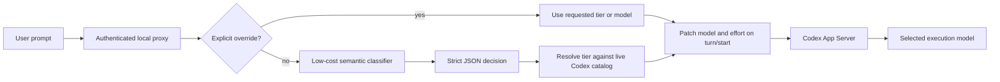
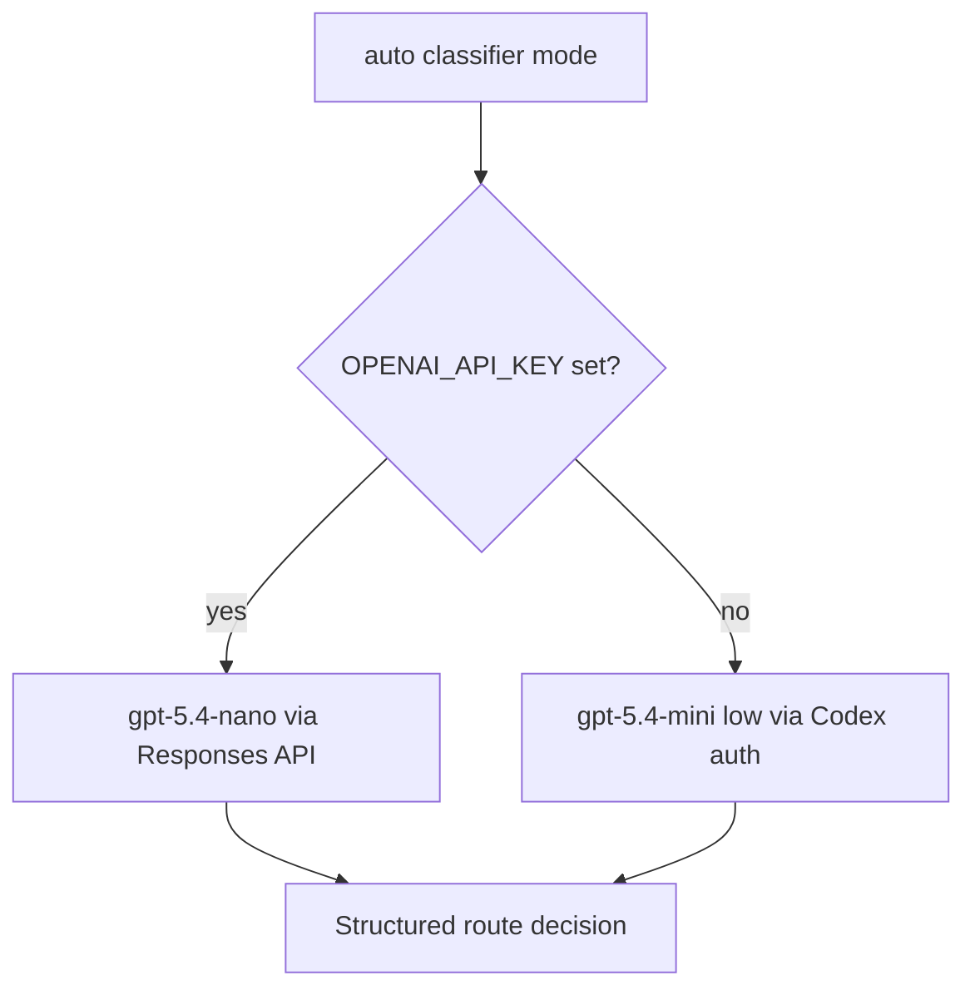
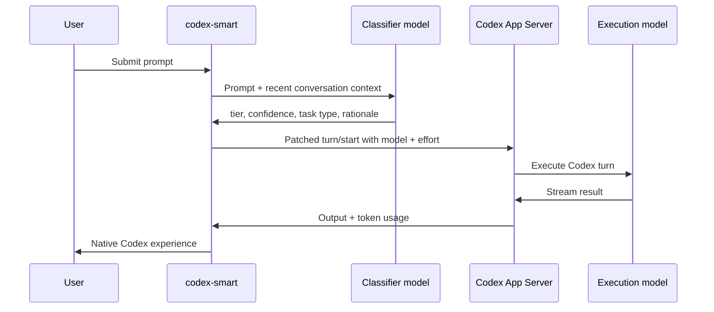

# Codex Smart Router

Codex Smart Router is a semantic control layer for Codex CLI. Before each turn, a low-cost classifier model understands the requested work and selects the execution model and reasoning effort most likely to complete it correctly.

It is not a replacement chatbot or a generic model gateway. It preserves Codex authentication, the native TUI, tools, approvals, skills, plugins, and conversation history.

## Why It Matters

The most expensive routing mistake is not choosing a larger model. It is choosing the wrong model, then paying for a failed attempt, a correction prompt, and another full agent turn.

Codex Smart Router evaluates semantic difficulty rather than prompt length. A short request such as “debug the production token race” can be harder than a long formatting specification. A follow-up such as “continue” is classified with recent conversation context rather than treated as an isolated one-word prompt.

## How It Works



The classifier receives the current prompt, up to six recent user prompts, the previous route and status, previous token usage, and image presence. It returns:

- execution tier
- confidence
- task type
- concise rationale

There are no keyword weights, prompt-length thresholds, or hidden heuristic fallbacks.

## Classifier Options



`gpt-5.4-nano` is the recommended classifier because it is designed for classification, supports strict structured output, and avoids loading a complete Codex agent runtime. The native fallback needs no separate API key, but it carries more input-token and latency overhead.

## Execution Tiers

| Tier | Default route | Intended work |
| --- | --- | --- |
| `economy` | `gpt-5.4-mini` + `low` | conversation, lookups, transformations, tiny edits |
| `balanced` | `gpt-5.6-luna` + `low` | focused implementation and straightforward debugging |
| `complex` | `gpt-5.6-terra` + `medium` | repository analysis, infrastructure, multi-file work, hard debugging |
| `frontier` | `gpt-5.6-sol` + `high` | architecture, deep research, security, production-critical work |
| `max` | `gpt-5.6-sol` + `max` | explicit escalation only |

The installed Codex model catalog remains authoritative. Model availability changes do not require hard-coded assumptions in the proxy.

## Runtime Architecture



## Controls

Start semantic routing:

```bash
codex-smart
```

Choose a classifier backend:

```bash
codex-smart --classifier openai
codex-smart --classifier codex
```

Inspect one decision without running the task:

```bash
codex-smart route "Create the Helm chart for this project"
```

Bypass classification for one turn:

```text
::route frontier
Review the authentication design.
```

## Evidence, Not Assumptions

The audit log stores no prompts or classifier rationales. It records classifier model, confidence, latency and token usage alongside the selected Codex model and the execution turn’s actual token usage.

```bash
codex-smart stats
codex-smart dashboard
```

This makes the optimization falsifiable: classifier overhead can be compared directly with the execution tokens it saves.

The dashboard is a local browser page bound to `127.0.0.1`. It shows model and tier distribution, 30-day token trend, routing coverage, classifier overhead, and estimated savings against `gpt-5.5` by default. It uses documented standard API prices for known GPT models and requires an explicit price mapping for unknown catalog models, so it does not guess billing data.

## Privacy And Safety

- The local proxy binds to `127.0.0.1` and requires a per-process bearer token.
- Classifier output must satisfy a strict JSON schema.
- Prompt content is explicitly treated as untrusted classifier data.
- Audit records omit prompt text and classifier rationale.
- The router never edits Codex configuration files.
- API classification sends recent user prompts to the configured OpenAI endpoint; native classification uses an ephemeral Codex session.

## Bottom Line

Codex Smart Router gives every prompt the model it deserves, based on what the work means rather than how many words describe it. Small requests stay economical, demanding work receives stronger reasoning, and every decision is measurable.
