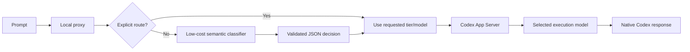
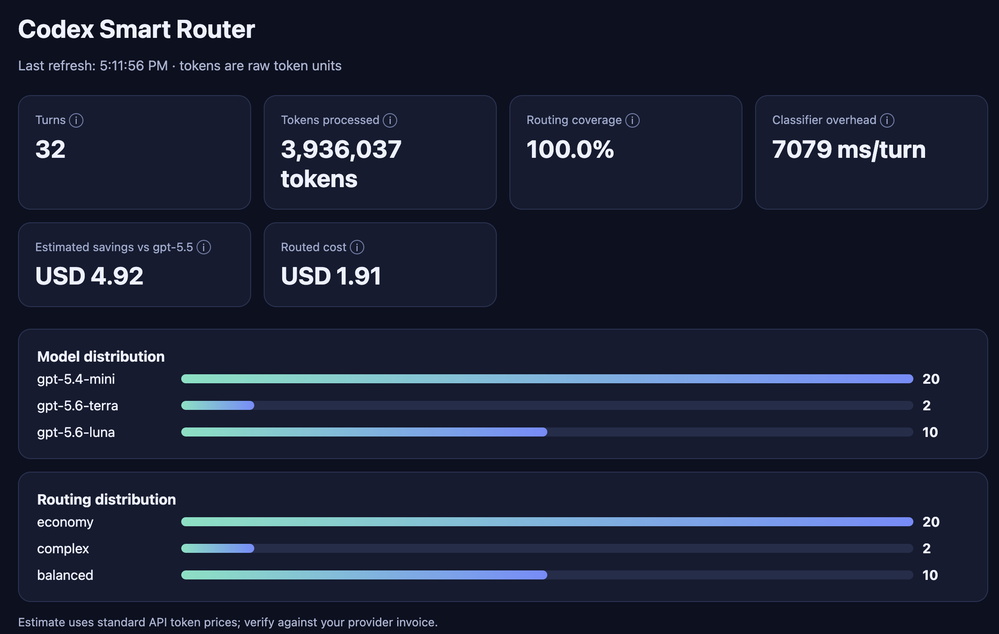

# Codex Smart Router

<p align="center">
  <strong>Give every Codex CLI prompt the model it deserves.</strong><br>
  Semantic routing for lower cost, better reasoning, and measurable results.
</p>

<p align="center">
  <a href="#quick-start">Quick start</a> ·
  <a href="#how-it-works">How it works</a> ·
  <a href="#dashboard">Dashboard</a> ·
  <a href="#contributing">Contributing</a>
</p>

<p align="center">
  
  
  
</p>

Codex Smart Router is a local semantic control layer for [Codex CLI](https://github.com/openai/codex). Before each turn, a low-cost classifier understands the work and selects an execution model and reasoning effort suited to its difficulty.

Small requests stay economical. Hard work gets stronger reasoning. A local browser dashboard shows whether the trade-off is actually worth it.

> **Experimental software.** Codex App Server integration and model availability can change as Codex evolves. Measure results in your own workload before relying on the router for production-critical automation.

## Why use it?

Using one powerful model for every prompt is simple, but often wasteful. Using a cheap model for every prompt is economical, but can create retries and corrections. Codex Smart Router makes that choice per turn based on semantic complexity—not keywords, prompt length, or a hidden score.

- **Native Codex experience** — authentication, TUI, tools, approvals, skills, plugins, and conversation history remain intact.
- **Semantic decisions** — the classifier considers the current prompt and recent conversation context.
- **Explicit control** — inspect a decision or override routing with `::route` whenever you want.
- **Measurable economics** — audit actual token usage and compare routed cost with a baseline model.
- **Privacy-aware telemetry** — audit records contain usage and routing metadata, never prompts or classifier rationales.

## How it works



The classifier returns a strict decision containing:

- execution tier
- confidence
- task type
- short rationale

Classification failures are surfaced to the user; the router does not silently fall back to keyword heuristics.

## Default routing policy

| Tier | Default route | Best for |
| --- | --- | --- |
| `economy` | `gpt-5.4-mini` · `low` | Conversation, lookups, transformations, tiny edits |
| `balanced` | `gpt-5.6-luna` · `low` | Focused implementation and straightforward debugging |
| `complex` | `gpt-5.6-terra` · `medium` | Repository analysis, infrastructure, multi-file work |
| `frontier` | `gpt-5.6-sol` · `high` | Architecture, deep research, security, critical work |
| `max` | `gpt-5.6-sol` · `max` | Explicit escalation only |

The installed Codex model catalog remains authoritative. If a preferred model is unavailable, the router resolves to the nearest configured fallback.

## Quick start

### Requirements

- Node.js 20 or newer
- Codex CLI with App Server support
- An OpenAI API key for the recommended classifier, or existing Codex authentication for the native fallback

### Install

```bash
git clone <your-repository-url>
cd codex-smart-router
npm install
npm link
```

For the recommended low-cost Responses API classifier:

```bash
export OPENAI_API_KEY="your-api-key"
codex-smart
```

Without an API key, `auto` uses native Codex authentication:

```bash
codex-smart
```

All normal Codex arguments pass through unchanged:

```bash
codex-smart -C /path/to/repo
codex-smart "Fix the failing test"
```

## Try it without running a task

Inspect the router’s real decision first:

```bash
codex-smart route "Create the Helm chart for this project"
codex-smart route --json "Design a zero-downtime authentication migration"
codex-smart models
codex-smart stats
```

Force a route for one turn by putting a directive on the first line of the prompt:

```text
::route economy
Summarize this file.
```

Supported tiers are `economy`, `balanced`, `complex`, `frontier`, `max`, `auto`, and `off`. You can also choose a model and effort directly:

```text
::route model=gpt-5.6-terra effort=high
Review this migration.
```

## Dashboard

The built-in dashboard turns routing into an evidence-based decision. It runs locally, reads the private audit log, and refreshes automatically.

### Screenshot




```bash
codex-smart dashboard
```

It shows:

- routed versus baseline cost
- estimated savings
- token usage and classifier overhead
- model and tier distribution
- routing coverage over time
- recent activity

The dashboard binds to `127.0.0.1` and opens in your browser. Use `--no-open` for a remote terminal or `--port 4310` to select a port.

Money is displayed explicitly in USD—for example, `USD 2.98`—to avoid confusing decimal separators with thousands separators.

The default baseline is `gpt-5.5`. Estimates use configurable standard API prices and are only shown when every model in the audit data has a known mapping. They are estimates, not invoices.

```bash
export CODEX_SMART_BASELINE_MODEL=gpt-5.5
export CODEX_SMART_PRICING='{"gpt-5.6-terra":{"inputPerMillion":5,"cachedInputPerMillion":0.5,"outputPerMillion":30}}'
codex-smart dashboard --no-open
```

## Classifier backends

`auto` selects the first available backend:

1. `gpt-5.4-nano` through the OpenAI Responses API when `OPENAI_API_KEY` is set.
2. `gpt-5.4-mini` with low reasoning through existing Codex authentication otherwise.

Choose explicitly when needed:

```bash
codex-smart --classifier openai
codex-smart --classifier codex
codex-smart --classifier openai --classifier-model gpt-5.4-nano
```

The OpenAI classifier is designed for structured classification. The native fallback needs no separate API account, but generally adds more latency and token overhead. Compare total routed usage—not just execution-model usage—before deciding which backend is best for you.

## Privacy and safety

- The proxy binds to `127.0.0.1` and uses a per-process bearer token.
- Classifier output is schema-validated before selecting a model.
- The router never modifies `~/.codex/config.toml`.
- Audit logs at `~/.codex/smart-router/routes.jsonl` do not store prompts or rationales.
- `--no-audit` disables audit logging.
- With the Responses API backend, the current prompt and up to six recent user prompts are sent to the configured API endpoint.

## Configuration

| Variable | Description |
| --- | --- |
| `OPENAI_API_KEY` | Enables the Responses API classifier |
| `OPENAI_BASE_URL` | Overrides the Responses API base URL |
| `CODEX_SMART_CLASSIFIER` | `auto`, `openai`, or `codex` |
| `CODEX_SMART_CLASSIFIER_MODEL` | Overrides the classifier model |
| `CODEX_SMART_CLASSIFIER_TIMEOUT` | Classifier timeout in milliseconds |
| `CODEX_SMART_CONFIG` | JSON execution-tier configuration |
| `CODEX_SMART_BASELINE_MODEL` | Dashboard comparison model; defaults to `gpt-5.5` |
| `CODEX_SMART_PRICING` | JSON price overrides in USD per million tokens |

For the full public design notes and architecture, see [`PUBLIC_DOCUMENTATION.md`](PUBLIC_DOCUMENTATION.md).

## Concise output

The router sets Codex’s first-party `model_verbosity` to `low` by default. Add `--terse` for a compact response policy that preserves warnings, commands, paths, and exact error text:

```bash
codex-smart --terse
```

## Development

```bash
npm install
npm test
npm run check
npm run test:integration
```

The integration test requires a working Codex App Server environment. Please include a focused test with pull requests that change routing, classification, telemetry, or dashboard behavior.

## Contributing

Issues, experiments, documentation improvements, and pull requests are welcome. A useful issue includes:

1. the Codex CLI version;
2. Node.js version;
3. classifier backend and model;
4. the command or minimal reproduction;
5. relevant output with secrets removed.

Please do not paste prompts, API keys, repository secrets, or private source code into issues or audit-log attachments.

## License

Apache-2.0. See [`package.json`](package.json) for the project metadata.
